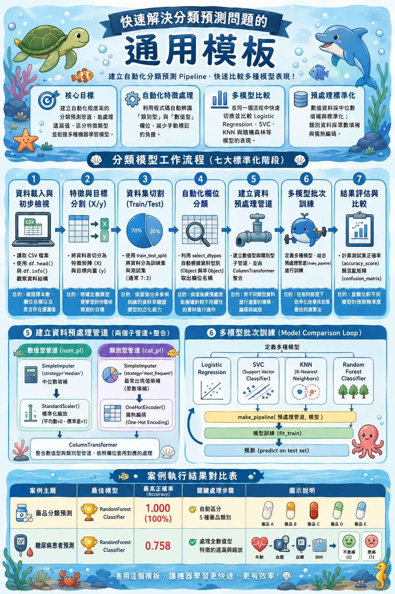

# 第 10 週｜分類模板、交叉驗證與網格搜尋

> 對應教科書：Ch10 分類模板、Ch11 交叉驗證、Ch12 網格搜尋

---

## 學習目標

1. 看懂並改寫分類預測的標準流程（資料前處理 → 切分 → 模型訓練 → 預測 → 評估）
2. 用 K-Fold 交叉驗證評估模型穩定性，避免單次切分誤差
3. 用 `GridSearchCV` 自動找最佳超參數組合

---

## 一、本週課程主軸（Ch10–Ch12）

### 1. 分類預測模板（Ch10）



> 上圖：本週要建立的「分類預測通用模板」概覽——七大標準化階段（資料載入 → 特徵與目標分離 → Train/Test 切分 → 自動化編碼 → Pipeline 預處理 → 多模型批次訓練 → 結果評估比較），以及 Logistic Regression / SVC / KNN / RandomForest 四模型對比的整體輪廓。

把前幾週學的分類器（KNN、SVM、決策樹）整理成共用的預測模板：

```python
from sklearn.model_selection import train_test_split
from sklearn.preprocessing import StandardScaler
from sklearn.neighbors import KNeighborsClassifier
from sklearn.metrics import accuracy_score, classification_report

X_train, X_test, y_train, y_test = train_test_split(X, y, test_size=0.2, random_state=42)

scaler = StandardScaler()
X_train_s = scaler.fit_transform(X_train)
X_test_s  = scaler.transform(X_test)

model = KNeighborsClassifier(n_neighbors=5)
model.fit(X_train_s, y_train)
y_pred = model.predict(X_test_s)

print("Accuracy:", accuracy_score(y_test, y_pred))
print(classification_report(y_test, y_pred))
```

Colab：[10 分類預測模版](https://colab.research.google.com/drive/1OqudZ0PDJ3YaUQPiOwilPG9vcCX2O9jt)

### 2. K-Fold 交叉驗證（Ch11）

單次 train/test 切分容易因運氣好壞影響結果，**K-Fold 把資料切 K 份輪流當測試集**，得到 K 個分數，取平均更穩定。

```python
from sklearn.model_selection import cross_val_score
scores = cross_val_score(model, X_s, y, cv=5, scoring='accuracy')
print(f"5-Fold mean = {scores.mean():.3f}, std = {scores.std():.3f}")
```

Colab：[11 交叉驗證](https://colab.research.google.com/drive/1YvHf8e4V5-OFlAClYlfgaE6xBJRvxNvo?usp=sharing)

### 3. GridSearchCV 網格搜尋（Ch12）

超參數（如 KNN 的 `n_neighbors`、SVM 的 `C`/`gamma`）會大幅影響表現，`GridSearchCV` **自動枚舉所有組合 + 交叉驗證 + 給最佳組合**。

```python
from sklearn.model_selection import GridSearchCV
param_grid = {'n_neighbors': [3, 5, 7, 9, 11]}
grid = GridSearchCV(KNeighborsClassifier(), param_grid, cv=5, scoring='accuracy')
grid.fit(X_s, y)
print("Best params:", grid.best_params_)
print("Best score:", grid.best_score_)
```

Colab：[12 模型參數挑選和網格搜尋](https://colab.research.google.com/drive/1o-I1M7RAbANMsawstOypcshUuDmNBaQ2?usp=sharing)

---

## 二、本週重點觀念複習卡

| 觀念 | 一句話記憶 |
|---|---|
| 分類模板 | `train_test_split → fit → predict → evaluate` 五步驟 |
| K-Fold 交叉驗證 | 切 K 份輪流當測試集，取平均分數比較穩 |
| GridSearchCV | 暴力枚舉所有超參數組合 + 交叉驗證 = 最佳組合 |

---

*下週起進入組合預測器（Ch13），請先熟悉本週三個 Colab。*
